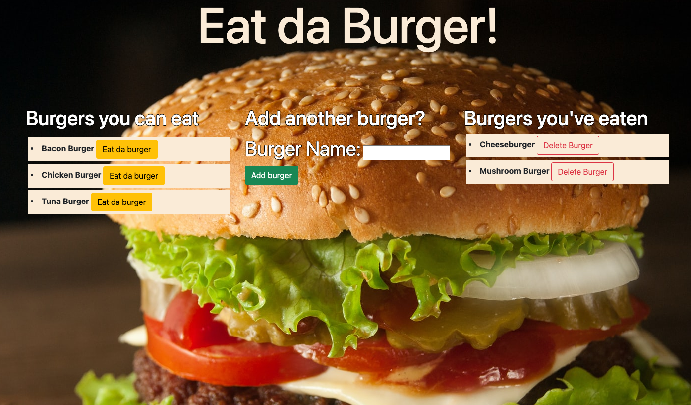

# Eat da burger

## Description

This application is a burger logger that uses MySQL, Node, Express, Handlebars, and a homemade ORM. The purpose of this application is to keep track of burgers that you want to try in the future and marking them off by "Eating the burger" once you've had them.

## Installation

To install this respository you will need MySQL, Node, Express, and Handlebars installed on your local machine using npm install.

## Usage

To run the application make sure that you are in the root directory and use your integrated terminal to type `node server.js`. Once you have the application running, you can type the name of the burgers you would like to try. These burgers will be saved on the left hand side of your application and once you "Eat da burger" they will be transferred to the right hand side. You also have the ability to delete burgers that you have already eaten.
